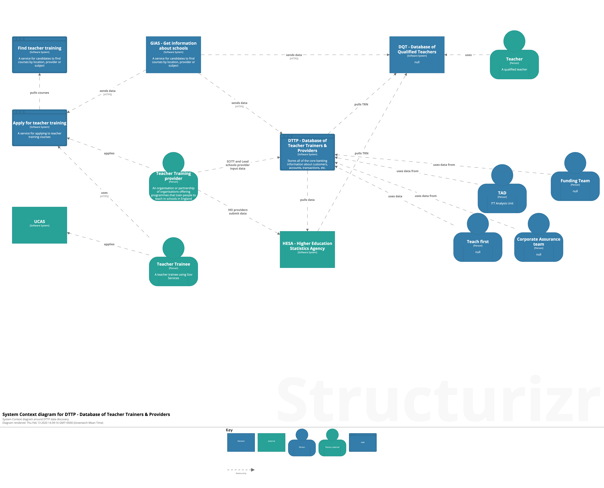

# Teacher trainees and providers data

## High-level diagrams

**Intended audience**: Everyone (technical and non-technical).

These diagrams aim to inform about the _users_ and _integrations_ around the system in focus. The drawings are intendedto support these questions:

- Who uses the system? (humans, internal or external)
- What is the use-case for the system, what problem does it solve?
- What integrations exist with other systems?

| Diagram | Description |
| --- | --- |
|   | Show the landscape of the DTTP (database for teacher trainees & providers data) application |
